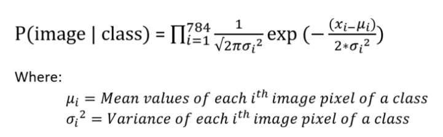
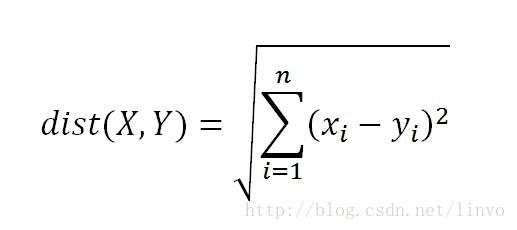

# Projet ML - Digit recongition en utilisant plusieurs algorithmes de machines learning 

## 1) Gaussian Naive Bayes

Nous avons travaillé avec le dataset MNIST qui comporte 70000 images de 784 pixels chacune (28*28) 
Nous avons réimplémenté l'algorithme **naive bayes gaussien** from scratch avec la librairie **numpy** pour avoir de meilleure performance. Nous avons ensuite entrainé notre algorithme avec 60000 images puis testé sur les 10000 restantes. L'utilisation de **numpy** étaient importantes pour éviter d'utiliser des boucles python qui sont plus lentes et ainsi pouvoir entrainé le modèles très rapidement même avec 60000 images.

### Le modèle 

Fichier `naivebayes.py`.

Notre modèle comporte donc 784 **features**, chaque pixel est une feature et il ya 10 classes : [0, 1, 2, 3, 4, 5, 6, 7, 8, 9]
La phase d'entrainement (fonction `fit` de la classe `Bayes`) consiste à calculer les **moyennes** pour chaque classe de chaque feature et les sotcker dans un tableau numpy de **shape (10, 784)** les lignes correspondent aux classes et les colonnes aux features/pixels. L'élément [1, 2] du tableau correspond donc à la moyenne des valeurs du pixel numéro 3 des images de MNIST avec le chiffre 1.
De même on genère un tableau **numpy** de **shape (10, 784)** pour le calcul des **variances**  des valeurs de chaque pixel pour chaque classe. 
Un dernier tableau de **shape (10, 1)** stock la valeur **p(class)**, la probabilité de chaque classe dans l'ensemble d'entrainement défini plus haut.

La **phase de test** (fonction `predict` consiste à calculer la probabilité pour les 10000 images de l'ensemble de test: p(images | class) pour les 10 classes et de prendre pour prédiction la classe qui a la plus forte probabilité. 

### Difficultés 

- **boucles python trop lentes** : Utilisation au maximum de **numpy**
  
- **Variance nulle** (tous les pixels à une certaine postition sont à 0) qui empêche de calculer la probabilité avec la formule ci-dessus. Ajout d'un bruit à la variance calculée : `var_noise`. 

- **probabilité trop petite: `10E-400`** et python n'a pas cette précision => Lissage des valeurs obetnus avec le logarithme : **log(P(class i| data))∝log(P(classi))+∑jlog(P(dataj|classi))** 

### Résultats 

Nous avons rajouté un hyper-paramètre appelé `var-noise`, et nous avons essayé de trouver quelle valeur pour cet hyper-paramètre donnait une meilleur **accuracy**. Nous avont trouvé un bruit d'à peu près 1000 qui donnait les meilleurs résultats. 
Nous obtenons une accuracy de **0.815** sur l'ensemble des 10000 images de l'ensemble d'entrainement. 

### GUI

Ficher `gui_bayes.py`. 
Sur de nouvelles données dessinées qui n'appartiennent pas au Dataset MNIST, l'accuracy est beaucoup plus faibles à peine 1/4. Peut être que le modèle entrainé est overfitté pour les données de MNIST. Les chiffres sont surement dessinés dans la même zone de l'image et avec une largeur de trait bien spécifique , j'ai essayé plusieurs tailles de pinceaux en vain pour le GUI en vain. Peut-etre une phase de Pooling pour réduire le nombre de pixels sur les images de MNIST lors de la phase d'entrainement permettrait d'avoir une meilleure accuracy et réduirait le biais de la largeur du trait et du placement du chiffre sur l'image. 

### Notebook

Fichier `notebook_naive_bayes.ipynb`.

## 2) KNN 

Fichier : `knn.py`

Pour l'algorithme des k-plus proches voisins, nous avons utilisé plusieurs représentations différentes pour les images et différentes forumles pour le calcul des distances. Nous avons également réimplémenté l'algorithme from scratch et en utilisant au maximum **numpy**. Il n'y a pas de phase d'entrainement car **knn** se contente de prédire la classe d'une image en calculant la distance de cette dernière avec chaque image de l'ensemble d'entrainment, de prendre les k images dont la distance est la plus petite, et de prendre la classe majoritaire parmis ces K images comme prédiction pour la nouvelle donnée. 

## Représentation matrice de pixel 0 et 1 (binary image) + distance euclidienne

Dans le fichier `freeman.py` la fonction `convert_binary` a été utilisée pour convertir les images en matrices de pixel de 0 et 1. 
Pour calculer la distance nous avons utilisé la formule ci-dessous:

ou xi représentent la valeur (0 ou 1 ) d'un pixel de l'image. 
On obtient une accuracy de 1 avec MNIST et 60000 images pour l'ensemble d'entrainement et 10000 images pour l'ensemble de test. 

### GUI 

Fichier: `gui_knn.py`. 

Sur de nouvelles données différentes du dataset MNIST on obtient encore une fois pas de très bon résultats mais toujours meilleurs qu'avec Bayes : environ 1/3 de bonnes prédictions. Encore une fois nous avons essayé différentes tailles de pinceaux pour le GUI en vain. 

## Représentation freeman + distance de Levenshtein

Cette fois-ci nous n'avons pas réussi à optimiser les calculs avec **numpy** contrairement avec la distance euclidienne, il était ainsi difficile de calculer les KNN avec les 60000 images de MNIST. Nous avons juste utilisé 4000 images pour l'ensemble d'entrainement et 10 images pour les tests et la valeur 6 pour l'hyper-paramètre K. Nous n'avons pas eu le temps d'optimiser le K également. 

Nous obtenons **0.9** d'accuracy. 

### GUI

Fichier: `gui_freeman2.py`

`gui_freeman2` convertit les 4000 images de MNIST de l'ensemble d'entrainement avant de lancer le GUI alors que `gui_freeman.py` convertit les 4000 images à chaque dessein de chiffre. 

Contrairement aux tests précédents, nous obtenons une bien meilleure accuracy sur de nouvelles données hors MNIST : environ 0.7 d'accuracy, par contre ça met beaucoup de temps à prédire un chiffre dessiné puisque qu'il n'y a pas de phase d'entrainement pour le KNN et donc il calcule les 4000 distances à chaque fois.  

### Notebook

Fichier `notebook_knn.ipynb`.

## Neural Network

Fichier: `nn.py`

Nous avons essayé plusieurs modèles avant d'arriver à celui dans `nn.py`.
### Les différentes architectures testées

### GUI

Fichier: `gui_neural_network.py`

Nous obtenons de meilleurs résultats avec le réseau de neuronnes qu'avec tous les autres algorithmes avec environ 0.9 d'accuracy sur des données dessinées dans le GUI. De plus vu que nous avons sauvegardé le modèle entrainé avec Keras (fichier `digit_recognition_optimized.h5`) et l'avons chargé dans le GUI, les prédictions sont rapides. 

## TODO

Nous n'avons pas eu le temps de faire de tableau comparatif et d'effectuer plus de test et de calculer différentes méthodes d'évaluation pour la qualité des algorithmes sur MNIST et sur des données hors MNIST. 

